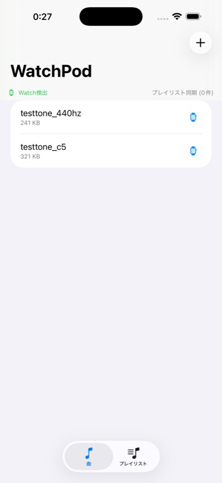
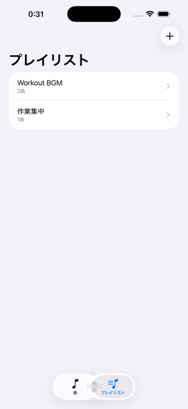
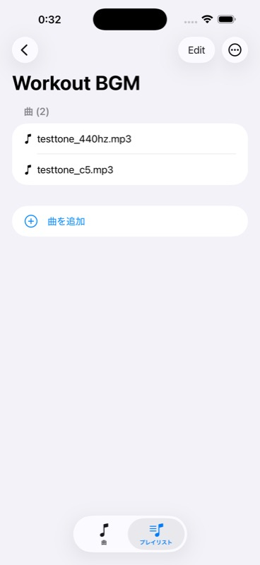
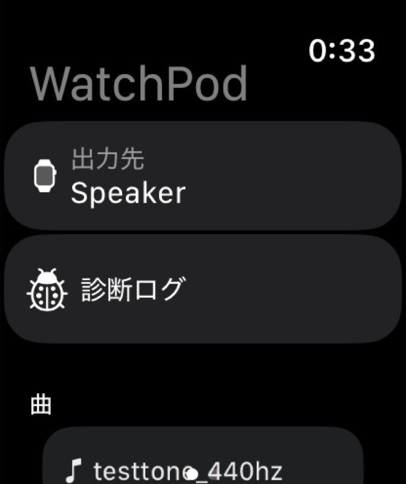
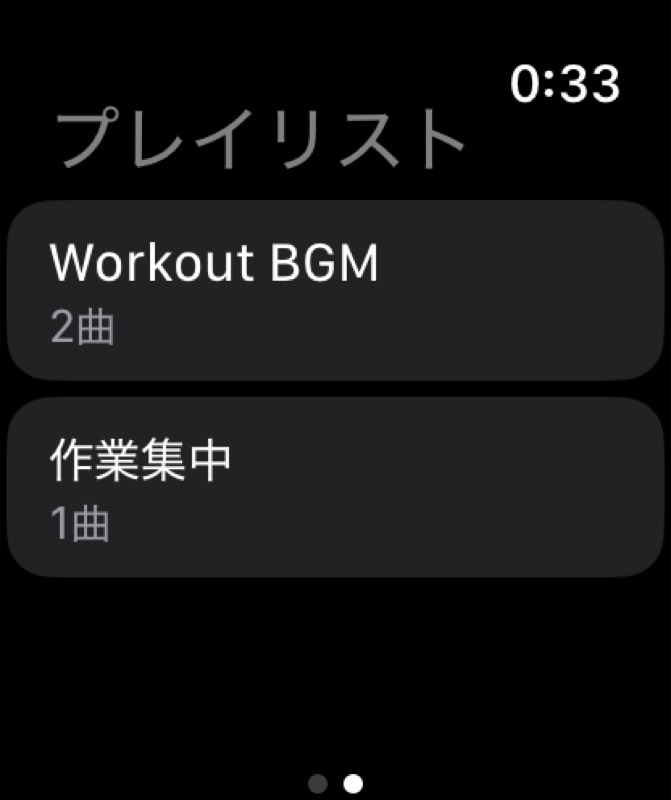

# WatchPod

Apple Watch + AirPods だけで自分の MP3 を聴く、超シンプルな iOS + watchOS アプリ。
iPhone をポケットに入れずに散歩・ジム・通勤したい人向け。

> **Status:** 個人検証用プロジェクト。App Store 未提出。
> **Platforms:** iOS 17.0+ / watchOS 9.0+
> **Stack:** Swift 5 / SwiftUI / WatchConnectivity / AVFoundation / MediaPlayer

## スクリーンショット

### iPhone
| 曲タブ | プレイリストタブ | プレイリスト詳細 |
|---|---|---|
|  |  |  |

### Apple Watch
| 曲一覧（出力先・診断ログ付き） | プレイリスト一覧 |
|---|---|
|  |  |

---

## 何ができる

### iPhone 側
- ファイルアプリから MP3 を取り込み
- 取り込んだ MP3 一覧表示
- **「Watch へ送信」** で WCSession 経由でファイル転送
- **「Watch から削除」** で Watch 側のファイルを遠隔削除
- **プレイリスト作成・編集** （複数曲を1グループに）
- プレイリストを Watch に同期

### Watch 側
- iPhone から受け取った MP3 の一覧表示
- タップで再生（AirPods/Watch スピーカー）
- プレイリスト一覧表示・連続再生・ループ再生
- 出力先表示（現在接続中のオーディオデバイス）
- Now Playing 統合（文字盤上に再生情報表示）
- 診断ログ画面（開発用）

---

## アーキテクチャ

```
WatchPod/
├── project.yml                  # xcodegen の唯一の真実
├── Shared/                      # 両ターゲット共有
│   └── Playlist.swift
├── WatchPod/                    # iOS app (jp.1qaz.WatchPod)
│   ├── WatchPodApp.swift
│   ├── ContentView.swift
│   ├── PlaylistListView.swift
│   ├── PlaylistDetailView.swift
│   ├── MP3Library.swift
│   ├── MP3Item.swift
│   ├── PlaylistStore.swift
│   ├── PhoneSessionManager.swift
│   └── Assets.xcassets/
├── WatchPod Watch App/          # watchOS app (jp.1qaz.WatchPod.watchkitapp)
│   ├── WatchPodWatchApp.swift
│   ├── WatchContentView.swift
│   ├── WatchPlaylistsView.swift
│   ├── WatchSessionManager.swift
│   ├── AudioPlayerManager.swift
│   ├── DiagnosticView.swift
│   └── Assets.xcassets/
└── TestAudio/                   # ffmpeg で生成したテスト用 MP3
```

`.xcodeproj` は `project.yml` から `xcodegen generate` で自動生成（git 管理外）。

---

## セットアップ

```bash
# 依存ツール
brew install xcodegen

# プロジェクト生成
cd WatchPod
xcodegen generate
open WatchPod.xcodeproj
```

Xcode で:
1. WatchPod / WatchPod Watch App 両ターゲットの Signing & Capabilities で自分の Team を選択
2. Bundle Identifier を自分のものに変更（`jp.1qaz.WatchPod` → `com.yourname.WatchPod` など）
3. iPhone を USB 接続して Run

watchOS シミュレータが未インストールなら `xcodebuild -downloadPlatform watchOS` で取得。

---

## ⚠️ 既知の制限：watchOS のバックグラウンド再生問題

このアプリで一番ハマったポイント。**結論から言うと、watchOS のサードパーティアプリでは Apple 純正の Music / Podcasts アプリと同じレベルのバックグラウンド再生は実装できない可能性が極めて高い** ことが分かりました（私の検証範囲では）。

ここからの内容は、私個人が WatchPod 開発中に体験した事実と、それに関連する公開情報を整理したものです。**私の実装ミス・設定ミス・OS バージョン固有の挙動・テスト環境固有の事象である可能性は否定できません。** 法的判断や Apple の公式見解を代弁するものではありません。

### 検証環境

| 項目 | 値 |
|---|---|
| Mac | macOS Darwin 25.5.0 |
| Xcode | 26.5 (Build 17F42) |
| iPhone 実機 | iPhone 17 Pro (iOS 26.4.2) |
| Watch 実機 | Apple Watch Series 11 (watchOS 26.5) |
| AirPods | （iPhone と Watch 両方にペアリング済み） |
| 検証日 | 2026年5月16〜17日 |

### 観測された症状

| シナリオ | 結果 |
|---|---|
| アプリ前面で再生 | ✅ 正常 |
| **手首を下ろして画面オフ**（アプリは前面のまま） | ✅ **再生継続** |
| **デジタルクラウン押下 → 文字盤に戻る** | ❌ **即座に再生停止** |
| 文字盤の Now Playing で ▶️ を押す | ❌ 何も起きない（音は出ない） |
| Watch アプリに戻ると即再生再開 | ✅ |

つまり「手首下ろし sleep」と「クラウン押下 dismiss」で挙動が完全に違う。

### 試した実装（全て効果なし）

| # | 試したこと | 結果 |
|---|---|---|
| 1 | `WKBackgroundModes = ["audio"]` を Info.plist に追加 | 効果なし |
| 2 | `AVAudioSession.setCategory(.playback, mode: .default, policy: .longFormAudio)` | 効果なし |
| 3 | `AVAudioSession.activate(options:)` async版で呼び出し | 効果なし |
| 4 | AVAudioPlayer → AVPlayer に変更（watchOS 4 以降 AVAudioPlayer はバックグラウンド非対応との情報に基づく） | 効果なし |
| 5 | `audiovisualBackgroundPlaybackPolicy = .continuesIfPossible` を AVPlayer に設定 | 効果なし |
| 6 | `MPNowPlayingInfoCenter` に再生情報登録 | Now Playing UI は表示されるが、再生は止まる |
| 7 | `MPRemoteCommandCenter` の play/pause/next ハンドラ登録 | コマンドは到達するが、`AVAudioSession.activate()` が `false` を返して再開不可 |
| 8 | `AVAudioSession.interruptionNotification` で `shouldResume` 検知 → 自動再開 | 文字盤戻りの場合は interruption notification 自体が来ない |
| 9 | `AVAudioSession.routeChangeNotification` で route 変化検知 → 自動再開 | 同上 |
| 10 | **`HKWorkoutSession` ハック**（Workoutとして起動して背景実行権を獲得する裏技）。`WKBackgroundModes = workout-processing` + HealthKit entitlement + HKLiveWorkoutBuilder で実機検証 | **効果なし。** `HKWorkoutSession` が active な状態でも、文字盤に戻ると AVPlayer は停止した。なお本実装は App Store 審査でリジェクトされる可能性が高いハックなので、検証後にコードから除去した（git 履歴には残る） |

### 診断ログから判明した核心

```
[0:16:26] ScenePhase=inactive rate=1.0    ← クラウン押下
[0:16:27] ScenePhase=background rate=1.0  ← 文字盤に移行
[0:16:27] rate 1.0 → 0.0                  ← OS が AVPlayer を強制 pause
[0:16:31] Remote: play                    ← Now Playing で ▶️
[0:16:32] resume activate=false           ← AudioSession 活性化を OS が拒否
```

**ScenePhase が `background` になった瞬間に AVPlayer が強制的に停止され、その状態では `AVAudioSession.activate()` が `false` を返す**。`audiovisualBackgroundPlaybackPolicy = .continuesIfPossible` は無視されている。

### Apple Developer Forum でも同様の報告（未解決）

[Apple Developer Forum thread/125827](https://developer.apple.com/forums/thread/125827) では別の開発者が同じ症状を報告し、`.longFormAudio` policy も `WKBackgroundModes audio` も試した結果、解決していません。Forum の議論は「これは watchOS のプラットフォーム制限の可能性」という示唆で終わっています。

### 一方で Apple 純正アプリは普通にできる

- **Apple Music**（watchOS 版）: AirPods 接続で文字盤に戻っても再生継続
- **Apple Podcasts**（watchOS 版）: 同上
- **Now Playing** ウィジェット: 上記アプリの操作は完璧に効く

サードパーティアプリ（私の試した範囲では WatchPod）と Apple 純正で挙動が違う。

---

## 🏛️ 独占禁止法・競争法の文脈

ここからは私見と公開情報の整理です。**法的アドバイスではありません。** 私の実装ミスや watchOS バージョン固有のバグである可能性は依然としてあります。

### 観測された差別的待遇（疑い）

私の検証範囲では、以下の構造が見られます:

1. サードパーティ音楽アプリは `AVAudioSession.activate()` がバックグラウンド状態で `false` を返す
2. Apple 純正アプリは同等のシナリオで継続再生できる
3. つまりサードパーティには公開されない privileged API or entitlement が Apple 純正アプリに与えられている可能性

これが事実であれば、自社プラットフォーム上で自社サービスを優遇している構造であり、各国の競争法・独占禁止法が問題視している類型に該当します。

### 既存の法的・規制的動き（参考）

| 地域 | 規制 / 訴訟 | 関連性 |
|---|---|---|
| 🇪🇺 EU | **Digital Markets Act (DMA)** 2024年施行。Apple は gatekeeper 指定 | サードパーティへの同等機能提供義務、watchOS も対象 |
| 🇪🇺 EU | 2024年 Apple に **€1.84B (約2900億円) の制裁金** | Spotify 申立による音楽ストリーミング市場での反競争行為認定 |
| 🇺🇸 US | **DOJ v. Apple** 2024年提訴 | Apple Watch / Apple Music の市場支配 |
| 🇺🇸 US | **Epic Games v. Apple** | App Store 全般の独占構造 |
| 🇯🇵 JP | **スマートフォン特定ソフトウェア競争促進法** 2024年6月成立、2025〜2026 施行 | App Store と OS のオープン化義務 |

### Spotify の長年の主張との一致

[Spotify の Time to Play Fair キャンペーン](https://www.timetoplayfair.com/) では、watchOS や HomePod での音楽再生における API 制限を長年問題提起しています。本プロジェクトで観測した症状は、その主張と整合する範囲のものです。

### 改めての免責

繰り返しになりますが:

- 上記は **私個人の WatchPod 開発過程での観測結果** に基づくものです
- **私の実装ミス・設定ミス・OS バージョン固有のバグの可能性は否定できません**
- Apple が「これはバッテリーとセキュリティのための制限である」と説明する立場を取ることもありえます
- 法的な判断は各国の規制当局と裁判所が行うものであり、本ドキュメントはそれらを代弁しません
- 本記述は将来の事実認定や法改正により内容が古くなる可能性があります

私が言いたいのはシンプルで、**「個人開発者として実装してみたら、Apple 純正と同じことが普通には実現できなかった。その差は世界的な競争法議論と整合しているように見えた」** という観測のシェアです。

もしこの症状を回避する正しい実装方法をご存知の方がいたら、Issue / Pull Request で教えてください。

---

## このアプリでの現実解

watchOS の制限を受け入れた上で、UX としては以下が現状最適:

1. **手首下ろし** → 画面オフでも再生継続（◎）
2. **クラウンで文字盤戻り** → 一時停止（許容）
3. **Watch アプリに戻る** → 即再生再開（即時）
4. **AirPods は Watch 専用にする**（iPhone との二股だと route change で更に切れやすい）

### 受け入れた制約

文字盤に戻ると音楽が止まるのは仕様として受け入れる。実用上は:
- **手首下ろしのスリープ中は再生継続**（散歩・ジムで使う想定なら大半のケースをカバー）
- 一時停止したくないシーンでは **アプリを前面に保ったままディスプレイをスリープ** にする運用

---

## ライセンス

MIT License

---

## クレジット

- アイコン: ChatGPT (gpt-image-1) で生成
- テスト MP3: ffmpeg で生成したサイン波
- 開発支援: Claude Code (Anthropic)
